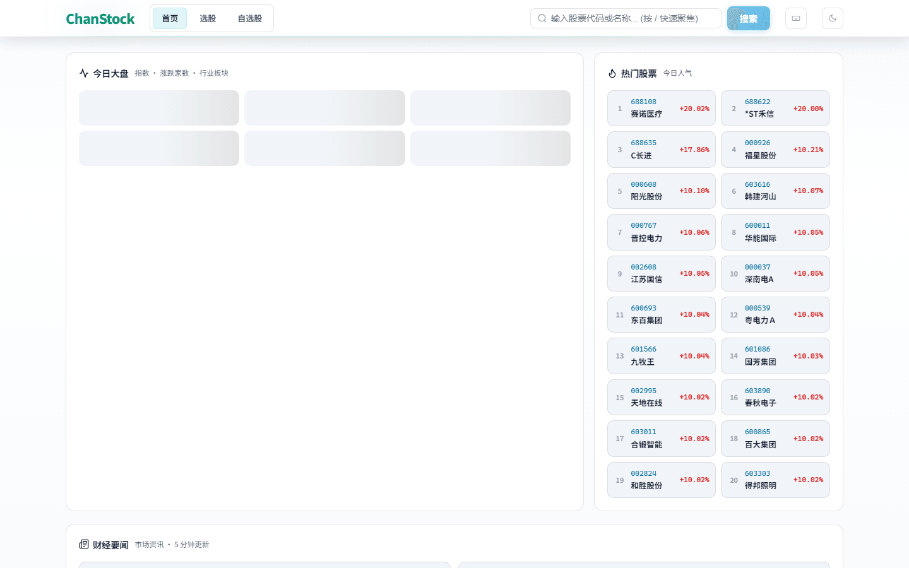
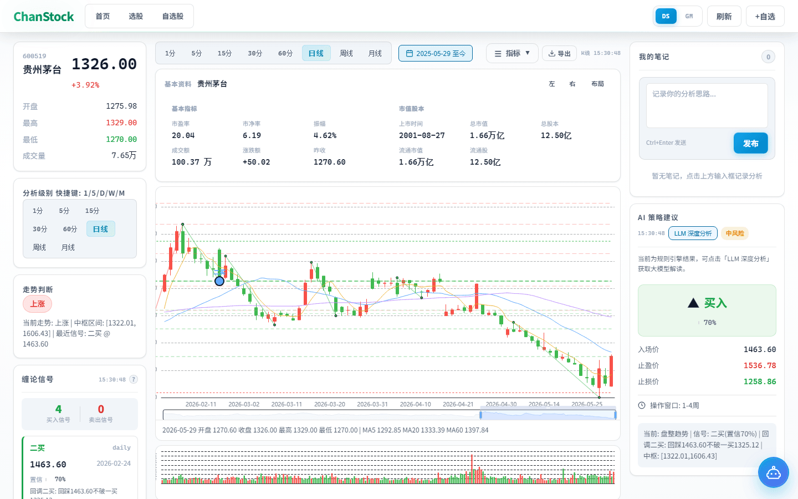
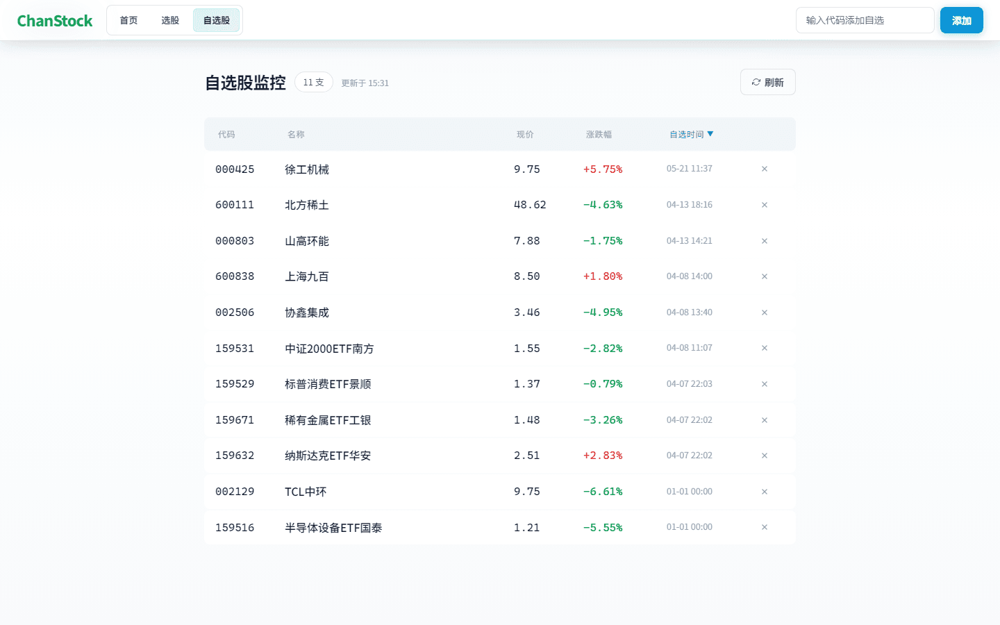
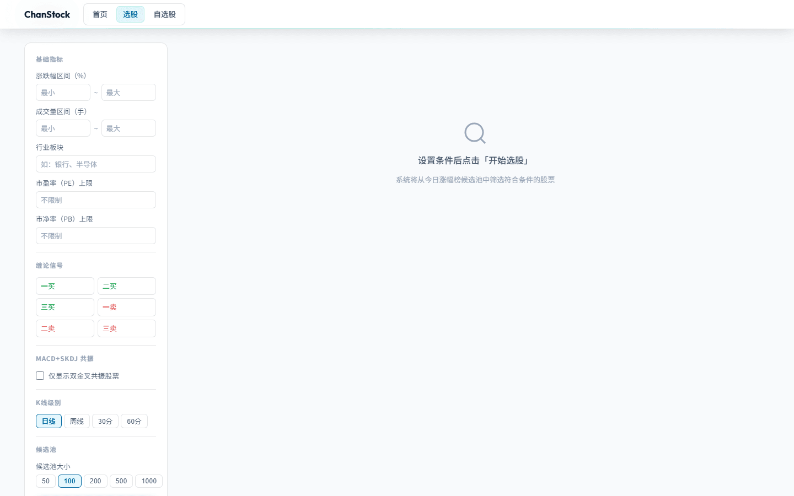
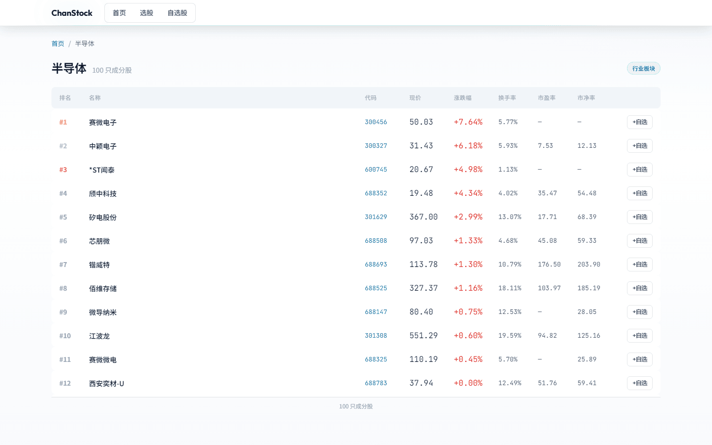
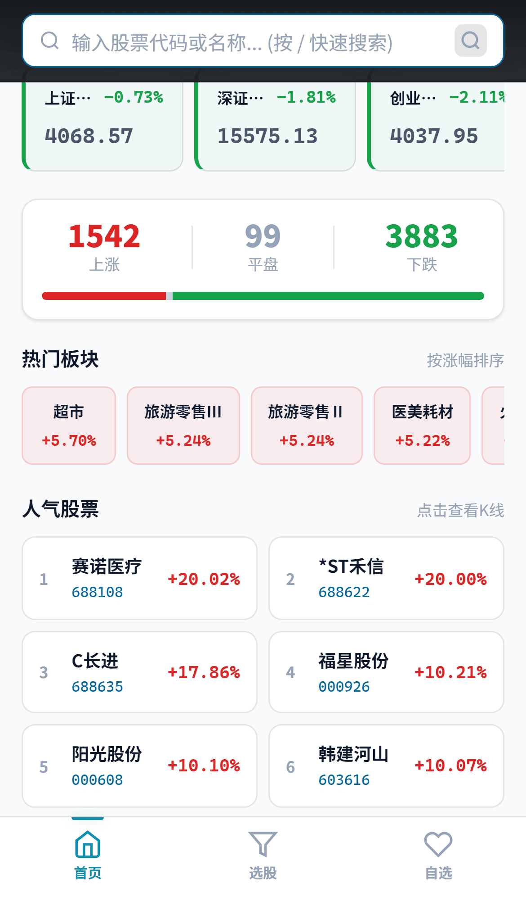
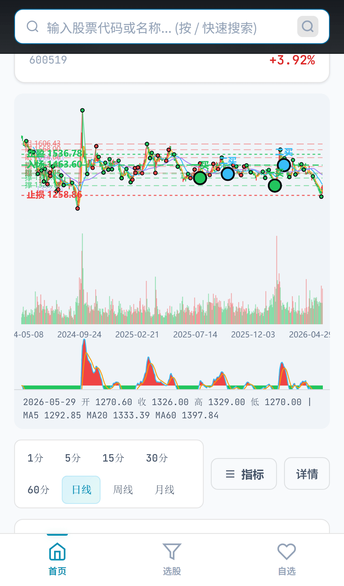
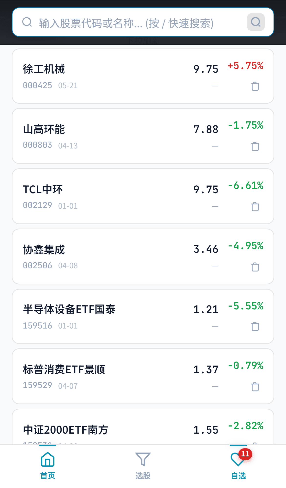
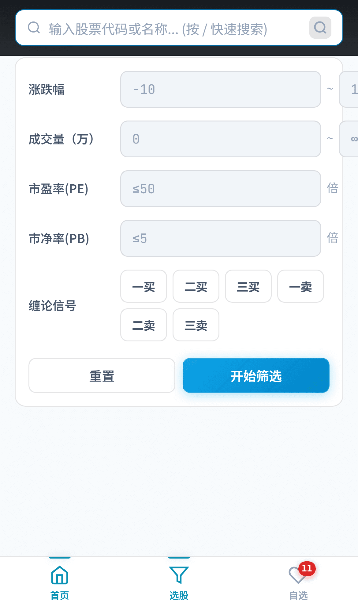
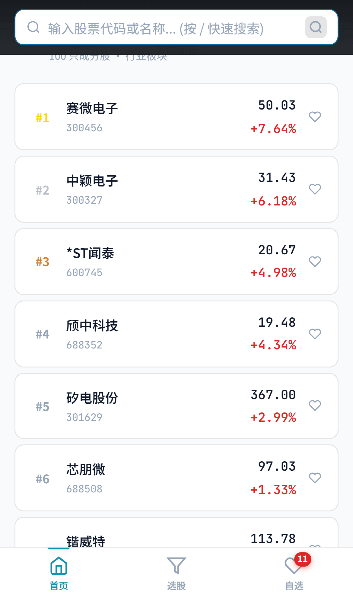

# ChanStock — 缠论智能股票分析系统

> 基于缠中说禅理论的智能股票分析工具，融合缠论结构识别、AI 背驰判断与多级别共振分析，支持 PC 端与移动端，涵盖 A 股日线/周线/月线及分钟级别 K 线可视化。

---

## 目录

- [界面预览](#界面预览)
- [项目概览](#项目概览)
- [系统架构](#系统架构)
- [目录结构](#目录结构)
- [功能与页面](#功能与页面)
- [技术栈](#技术栈)
- [安装部署](#安装部署)
- [API 接口文档](#api-接口文档)
- [缠论算法说明](#缠论算法说明)
- [配置与参数](#配置与参数)
- [常见问题](#常见问题)
- [免责声明](#免责声明)

---

## 界面预览

各核心页面截图如下（由 `scripts/capture-readme-screenshots.mjs` 自动生成，脚本会自动探测 5173–5188 端口）。下文不再重复嵌入同一张图。

### PC 端

**首页** — 六大指数、涨跌家数、热门板块与人气股票，每 5 分钟自动刷新



**个股分析** — 三栏布局：缠论信号 + 多级别 K 线 + AI 策略与笔记；右下角悬浮球展开 AI 诊股



**自选股** — 添加/删除、实时涨跌幅、最后更新时间，每 2 分钟自动刷新



**条件选股** — MACD+SKDJ 共振、缠论买卖点、基本面多维筛选，SSE 流式返回



**板块详情** — 行业/概念成分股排行，支持一键加入自选



### 移动端

**首页** — 搜索栏 + 指数 + 涨跌家数 + 热门板块/股票，底部 Tab 导航



**个股分析** — K 线全屏、级别切换、指标选择，详情通过底部抽屉展开



**自选股** — 下拉刷新、涨跌幅列表，与 PC 数据同步



**条件选股** — 移动端筛选表单，SSE 流式结果



**板块详情** — 成分股卡片列表，触屏优化



---

## 项目概览

ChanStock 是一款面向 A 股的智能技术分析工具，核心逻辑基于缠中说禅理论，通过程序化识别分型、笔、线段、中枢等结构，判断趋势、背驰与买卖点，并结合 AI 大模型（DeepSeek V4 Pro / Gemini）输出可操作的投资建议。

打开应用，首屏即可纵览 A 股市场：主要指数、涨跌家数、热门板块与人气股票集中展示，每 5 分钟自动刷新。界面见 [界面预览 · PC 首页](#pc-端)。

### 目标用户

- **缠论学习者**：借助系统快速识别笔、线段、中枢，将理论应用于实战
- **技术分析爱好者**：综合 MA、MACD、RSI、SKDJ 等经典指标与缠论结构
- **量化研究开发者**：基于缠论数据接口做二次策略开发

同一套后端，PC 与移动端共用路由与 API。移动端针对触屏做了搜索、K 线滑动与底部 Tab 导航优化，外出也能快速查行情、看缠论。界面见 [界面预览 · 移动端](#移动端)。

---

## 系统架构

### 技术架构图

```
┌──────────────────────────────────────────────────────────────┐
│                     前端  (Vue 3 + TypeScript + ECharts)       │
│                        统一项目，端口 5173                      │
│                                                              │
│   ┌────────────────────────┐    ┌────────────────────────┐   │
│   │      PC 端             │    │      移动端 (/m/)       │   │
│   │  HomeView             │    │  MobileHomeView         │   │
│   │  StockView            │    │  MobileStockView        │   │
│   │  WatchlistView        │    │  MobileWatchlistView    │   │
│   │  StockScreenView      │    │  MobileScreenView       │   │
│   │  SectorView           │    │  MobileSectorView       │   │
│   └───────────┬────────────┘    └───────────┬────────────┘   │
│               │                              │                │
│               └──────────────┬───────────────┘                │
│                          Pinia Store                          │
│               ┌──────────────┼───────────────┐                │
│               │ chanlunStore  │ watchlistStore │                │
│               │ commentStore  │                │                │
│               └───────┬───────┴───────┬───────┘                │
│                       │  axios /api   │                        │
│                       └───────────────┼────────────────────────┘
│                                │ /api 或 /{base}/api │   默认 8010（run_server）
│    ┌─────────────────────────┼───────────────┼────────────────────────┐
│    │                     后端 (FastAPI + Uvicorn)                    │
│    │                                                              │
│    │   ┌──────────────────────────────────────────────────────┐   │
│    │   │         REST API（routers/ + main.py 挂载）             │   │
│    │   │   /api/stocks/*  /api/chanlun/*  /api/watchlist/*   │   │
│    │   │   /api/market/*  /api/sector/*  /api/comments/*    │   │
│    │   └──────────────────────────────────────────────────────┘   │
│    │                            │                                 │
│    │   ┌────────────────────────┼────────────────────────────┐   │
│    │   │                      业务逻辑层                       │   │
│    │   │  ChanlunEngine  BiDetector  FenxingDetector         │   │
│    │   │  SegmentDetector  SignalDetector  StrategyEngine      │   │
│    │   │  DivergenceDetector  WaveClassifier                 │   │
│    │   └──────────────────────────────────────────────────────┘   │
│    │                            │                                 │
│    │   ┌──────────────────────────────────────────────────────┐   │
│    │   │        数据服务层 (akshare 多源降级：东方财富/腾讯/新浪)  │   │
│    │   └──────────────────────────────────────────────────────┘   │
│    │                            │                                 │
│    │   ┌──────────────────────────────────────────────────────┐   │
│    │   │           AI 层 (DeepSeek / Gemini，可选)               │   │
│    │   └──────────────────────────────────────────────────────┘   │
│    └──────────────────────────────────────────────────────────────┘
```

### 端口说明

| 服务 | 地址 |
|------|------|
| 前端（PC + 移动端统一） | 默认 http://localhost:5173（端口占用时 Vite 会顺延）；截图专用 **`npm run dev:screenshots`** 固定 **5188** |
| 后端 API（推荐） | **`python run_server.py`**：默认 **http://127.0.0.1:8010**（可用环境变量 **`PORT`** 修改，例如 `PORT=8000`） |
| 后端 API（备选） | **`python main.py`**：固定 **http://127.0.0.1:8000** |

开发环境下，Vite 将 **`/api`** 与 **`/{base}/api`** 代理到 **`http://127.0.0.1:8010`**（可通过环境变量 **`VITE_API_PROXY_TARGET`** 覆盖）。请保证该地址与当前启动的后端端口一致。

默认前端 **`vite.config.ts` 的 `base` 为 `/stock-chanlun/`**，开发时请在浏览器打开 **`http://localhost:5173/stock-chanlun/`**（端口以终端输出为准）。路由仍写作 `/`、`/stock/:code` 等，由 Vue Router 与 `base` 拼接。

### URL 路由

**PC 端**（相对于前端 `base`，例如 `/stock-chanlun/`）

| 路径 | 页面 |
|------|------|
| `/` | 首页：大盘指数、热门板块、热门股票、财经要闻 |
| `/stock/:code` | 个股分析页：三栏布局（行情统计 + K线图 + AI策略） |
| `/watchlist` | 自选股监控：添加/删除/刷新 |
| `/screen` | 条件选股：SSE 流式结果 |
| `/sector/:name` | 板块详情页：成分股列表 |

**移动端**

| 路径 | 页面 |
|------|------|
| `/m/` | 首页：搜索栏 + 指数 + 热门板块 + 热门股票 |
| `/m/stock/:code` | 个股页：顶部价格 + K线图 + 级别切换 + 底部抽屉 |
| `/m/watchlist` | 自选股列表 |
| `/m/screen` | 条件选股 |
| `/m/sector/:name` | 板块详情页（移动端） |

---

## 目录结构

```
stock-chanlun/
├── .github/workflows/                   # CI（前端 Pages 部署、后端 pytest）
├── backend/                              # FastAPI 后端
│   ├── main.py                         # 应用入口：CORS、lifespan、挂载 routers
│   ├── config.py                       # 环境变量（CORS、金融 TLS 等）
│   ├── http_adapter_patch.py           # requests 补丁（金融域名禁用代理等）
│   ├── deps.py                         # 依赖注入：客户端 IP、限流校验
│   ├── routers/                        # 按域拆分的路由
│   │   ├── stocks.py                  # 行情、K 线、选股、大盘、新闻、板块
│   │   ├── chanlun_routes.py          # 缠论分析、多级别、AI 策略
│   │   ├── watchlist.py / comments.py / system.py / diagnosis.py
│   ├── core/                           # 共享分析辅助（chanlun_analysis、数值工具）
│   ├── stores/                         # 自选/笔记/设置的本地 JSON 持久化（带锁）
│   ├── chanlun/                        # 缠论核心算法
│   │   ├── elements.py              # Pydantic 数据模型
│   │   ├── engine.py                 # 缠论引擎（整合所有分析步骤）
│   │   ├── kline_processor.py        # K 线预处理
│   │   ├── fenxing_detector.py       # 分型检测器
│   │   ├── bi_detector.py            # 笔检测器
│   │   ├── segment_detector.py       # 线段 & 中枢检测器
│   │   └── signals.py                # 买卖点判定 + 支撑阻力位
│   ├── ai/                            # AI 增强模块
│   │   ├── llm_client.py            # LLM 客户端（DeepSeek / Gemini）
│   │   ├── chat_sessions.py         # 诊股对话会话（进程内）
│   │   ├── analysis_agent.py        # Prompt 构建 & 响应解析
│   │   ├── strategy_engine.py       # 规则策略引擎
│   │   ├── wave_classifier.py        # 走势分类器
│   │   └── divergence.py             # 背驰检测器
│   ├── services/                      # 数据服务
│   │   ├── akshare_service.py        # 多源数据（东方财富/腾讯/新浪，含降级）
│   │   └── screening_service.py       # 选股服务（SSE 流式）
│   ├── requirements.txt
│   ├── tests/                         # pytest（缠论组件、工具、LLM 解析、背驰边界）
│   ├── .env.example                   # 环境变量示例（复制为 .env）
│   ├── .env                           # 本地密钥（勿提交）：AI Key、CORS 等
│   ├── watchlist.json.example         # 自选股模板（复制为 watchlist.json）
│   ├── comments.json.example          # 笔记模板（复制为 comments.json）
│   └── settings.json.example          # AI 模型设置模板（复制为 settings.json）
│
├── frontend/                           # Vue 3 前端（统一项目）
│   ├── src/
│   │   ├── main.ts
│   │   ├── App.vue
│   │   ├── api/
│   │   │   └── stock.ts            # resolveApiBaseURL、axios、类型与错误拦截
│   │   ├── stores/
│   │   │   ├── chanlun.ts         # 缠论状态（独立错误状态）
│   │   │   ├── watchlist.ts       # 自选股状态（含乐观更新回滚）
│   │   │   └── comment.ts         # 笔记评论状态
│   │   ├── router/
│   │   │   └── index.ts          # 统一路由（PC + Mobile）
│   │   ├── composables/
│   │   │   ├── useToast.ts        # Toast 通知系统（统一方案）
│   │   │   ├── useLoading.ts     # 全局加载状态
│   │   │   ├── useInterval.ts     # 定时器 hooks
│   │   │   ├── useDebounce.ts     # 防抖节流
│   │   │   ├── useClipboard.ts     # 剪贴板
│   │   │   ├── useStorage.ts      # LocalStorage
│   │   │   └── useFormatters.ts   # 数据格式化
│   │   ├── views/                  # PC 页面
│   │   │   ├── HomeView.vue          # 首页：大盘/板块/股票/新闻，自动5分钟刷新
│   │   │   ├── StockView.vue          # 个股：多级别K线+缠论+AI策略，键盘快捷键
│   │   │   ├── WatchlistView.vue     # 自选股：排序/自动2分钟刷新
│   │   │   ├── StockScreenView.vue   # 选股：SSE流式+进度+错误处理
│   │   │   └── SectorView.vue       # 板块详情
│   │   ├── components/
│   │   │   ├── Chart/
│   │   │   │   ├── KLineChart.vue     # 主图（K线 + 缠论叠加）
│   │   │   │   ├── VolumeChart.vue   # 成交量副图
│   │   │   │   ├── MACDChart.vue      # MACD（DIF/DEA + 柱状图）
│   │   │   │   ├── RSIChart.vue       # RSI 副图
│   │   │   │   └── SKDJChart.vue      # SKDJ 副图
│   │   │   ├── Signal/
│   │   │   │   ├── SignalCard.vue     # 买卖点卡片
│   │   │   │   ├── StrategyCard.vue   # AI 策略卡片
│   │   │   │   ├── AIChat.vue              # AI 诊股对话（SSE；悬浮球内复用）
│   │   │   │   ├── AiSuspendedBallChat.vue # 个股页：右下角悬浮球展开诊股
│   │   │   │   └── CommentSection.vue # 笔记评论
│   │   │   ├── IndicatorSelector.vue # 指标选择器
│   │   │   └── SkeletonLoader.vue   # 骨架屏组件
│   │   └── mobile/                  # 移动端页面和组件
│   │       ├── views/
│   │       │   ├── MobileHomeView.vue
│   │       │   ├── MobileStockView.vue
│   │       │   ├── MobileWatchlistView.vue
│   │       │   ├── MobileScreenView.vue
│   │       │   └── MobileSectorView.vue
│   │       └── components/
│   │           ├── MobileLayout.vue
│   │           ├── MobileBottomNav.vue
│   │           ├── MobileSearchBar.vue
│   │           ├── MobileKLineChart.vue   # 移动端K线：触摸滑动/长按tooltip
│   │           ├── MobileIndicatorSelector.vue
│   │           ├── MobileStockSheet.vue   # 底部抽屉（行情/缠论/AI/笔记）
│   │           ├── MobileCommentSection.vue
│   │           └── PullRefresh.vue        # 下拉刷新组件
│   ├── package.json
│   ├── vite.config.ts              # base、开发代理（默认 → 127.0.0.1:8010）
│   ├── .env.production             # 生产构建：VITE_BASE_URL、VITE_API_BASE_URL
│   └── index.html
│
├── assets/
│   └── screenshots/                     # README 界面截图
├── scripts/
│   └── capture-readme-screenshots.mjs   # 截图生成脚本（Playwright）
├── README.md
```

---

## 功能与页面

以下路径为 **Vue Router 路径**（浏览器地址栏需加前端 `base`，默认 `/stock-chanlun/`）。各页面截图见 [界面预览](#界面预览)。

### 页面路由

| 路径 | 平台 | 功能摘要 |
|------|------|----------|
| `/` | PC | 大盘指数、热门板块/股票、财经要闻，5 分钟刷新 |
| `/stock/:code` | PC | 三栏个股分析；快捷键 R 刷新、1/5/D/W/M 切换级别 |
| `/watchlist` | PC | 自选股监控，2 分钟自动刷新 |
| `/screen` | PC | 条件选股，SSE 流式 + 进度条 |
| `/sector/:name` | PC | 板块成分股，按涨跌幅排序 |
| `/m/` | 移动 | 搜索 + 指数 + 热门板块/股票 |
| `/m/stock/:code` | 移动 | K 线 + 级别切换 + 底部抽屉（行情/缠论/AI/笔记） |
| `/m/watchlist` | 移动 | 自选股列表，下拉刷新 |
| `/m/screen` | 移动 | 条件选股（触屏表单） |
| `/m/sector/:name` | 移动 | 板块详情（卡片列表） |

### 缠论结构识别

| 功能 | 说明 |
|------|------|
| **分型检测** | 自动识别顶分型和底分型，严格五笔窗口；包含关系处理由两根K线相对位置决定方向 |
| **笔识别** | 顶分型 + 底分型，默认至少 5 根 K 线 |
| **线段识别** | 由连续 3 笔重叠构成，代表次级别走势 |
| **中枢识别** | 连续 3 个同级别线段重叠区域，输出上下沿价格区间 |
| **走势判断** | 上涨/下跌/盘整/震荡 |

### 买卖点判定

**买点**

| 买点 | 条件 |
|------|------|
| **一买** | 下跌趋势背驰点：当前段力度 < 前一段力度×0.8，且价格创阶段新低 |
| **二买** | 一买后回调低点，回调低点不跌破一买点 |
| **三买** | 向上笔确认突破某中枢后，回踩低点不跌入该中枢上沿 |

**卖点**

| 卖点 | 条件 |
|------|------|
| **一卖** | 上涨趋势背驰点：当前段力度 < 前一段力度×0.8 |
| **二卖** | 一卖后反弹高点，不超过一卖点 |
| **三卖** | 向下笔确认跌破某中枢后，反弹高点不突破该中枢下沿 |

### 支撑阻力位

多级别自动计算并标注：中枢上下沿（强度 0.85）> 线段高低点（0.75）> 笔高低点（0.6）> 买卖点价格 > 历史高低价（0.5）。

### K 线可视化

主图叠加：MA5/20/60、笔（红涨绿跌）、线段（黄/橙）、中枢（紫色矩形）、买卖点标记、AI 入场/止损/止盈线、支撑阻力水平线。副图：成交量、MACD、RSI、SKDJ。主图/副图支持降采样以提升渲染性能。

### AI 策略与诊股

规则策略引擎 + MACD 背驰 + 走势分类 + 多级别共振（日线+30分钟）+ LLM 分析（需 API Key，默认 DeepSeek V4 Pro）。个股页集中展示：PC 三栏 + 诊股悬浮球；移动端 K 线 + 底部抽屉。

### 大盘、板块、选股与自选

- **大盘概览**：六大指数 + 涨跌家数 + 板块排行，5 分钟刷新
- **板块详情**：行业/概念成分股，一键加自选
- **智能选股**：MACD+SKDJ 双金叉 + 缠论买卖点 + 基本面过滤，SSE 流式
- **自选股**：添加/删除、排序、2 分钟刷新

### 笔记与扩展信息

- **个股扩展**：五档盘口、行业/概念、财经新闻（`extras` 接口聚合）
- **股票笔记**：PC 右侧栏 / 移动抽屉 Tab，支持 CRUD
- **AI 诊股**：流式对话、多轮记忆、模型切换、快捷问题推荐

---

## 技术栈

### 后端

| 技术 | 版本 | 用途 |
|------|------|------|
| Python | 3.10+ | 主力语言 |
| FastAPI | 0.115.x | Web 框架，异步 API |
| Uvicorn | 0.32.x | ASGI 服务器 |
| AKShare | 1.14.x | 金融数据源 |
| Pandas | 2.2.x | K 线数据处理 |
| NumPy | 1.26.x | 数值计算 |
| Pydantic | 2.10.x | 数据模型校验 |
| httpx | 0.28.x | HTTP 客户端 |
| TA-Lib (ta) | 1.9.x | 技术指标计算 |
| python-dotenv | 1.0.x | 环境变量加载 |

### 前端

| 技术 | 版本 | 用途 |
|------|------|------|
| Vue 3 | 3.5.x | 渐进式 JS 框架 |
| TypeScript | 5.7.x | 类型安全 |
| Vite | 6.0.x | 构建工具 |
| Pinia | 2.3.x | 状态管理 |
| Vue Router | 4.5.x | 前端路由 |
| ECharts | 5.5.x | K 线 & 副图图表库 |
| vue-echarts | 7.0.x | Vue + ECharts 绑定 |
| Axios | 1.7.x | HTTP 请求 |

### AI 模型（可选）

| 模型 | 用途 |
|------|------|
| DeepSeek V4 Pro（`deepseek-v4-pro`，默认） | 自然语言缠论分析、AI 诊股对话 |
| Gemini API | 自然语言缠论分析（可在个股页切换） |

---

## 安装部署

### 前置条件

- Python 3.10+
- Node.js 18+
- npm 或 pnpm

### 1. 克隆项目

```bash
git clone <repo-url>
cd stock-chanlun
```

### 2. 安装后端依赖

```bash
cd backend

# 创建虚拟环境（推荐）
python -m venv .venv

# Windows 激活
.venv\Scripts\activate

# macOS/Linux 激活
source .venv/bin/activate

# 安装依赖
pip install -r requirements.txt
```

### 3. 配置环境变量与本地数据（可选）

可参考 `backend/.env.example` 在 `backend/` 下创建 `.env`。首次运行前，将 JSON 模板复制为本地文件（勿提交 Git）：

```bash
cd backend
cp settings.json.example settings.json
cp watchlist.json.example watchlist.json
cp comments.json.example comments.json
```

`.env` 示例：

```env
# DeepSeek API（可选，默认模型 deepseek-v4-pro）
DEEPSEEK_API_KEY=sk-xxxxxxxxxxxxxxxxxxxx
# DEEPSEEK_MODEL_ID=deepseek-v4-pro

# Gemini API（可选，二选一）
GEMINI_API_KEY=AIzaSyxxxxxxxxxxxxxxxxxxxx

# 生产建议：逗号分隔的前端源，默认 *（此时浏览器跨域凭证关闭）
# CORS_ORIGINS=http://localhost:5173,https://yourname.github.io

# 仅在东方财富等接口 SSL/代理异常时设为 1（默认校验证书，更安全）
# FINANCE_TLS_RELAXED=0
```

> 不配置 AI Key 时，系统以纯规则模式运行，所有缠论分析和买卖点判定仍然正常工作，仅 LLM 增强分析不可用。

### 4. 启动后端

```bash
cd backend

# 推荐：与前端默认代理一致（默认端口 8010）
python run_server.py

# API 文档：http://127.0.0.1:8010/docs
# 健康检查：http://127.0.0.1:8010/health

# 备选：直接运行 main（固定端口 8000；此时请把 VITE_API_PROXY_TARGET 设为 http://127.0.0.1:8000）
# python main.py
```

> **注意**：本地开发默认 **`run_server.py` → 8010**；`python main.py` 仍为 **8000**。修改端口可设置环境变量 **`PORT`**（仅对 `run_server.py` 生效），并同步 **`VITE_API_PROXY_TARGET`** 或前端请求地址。

### 5. 安装前端依赖

```bash
cd frontend
npm install
```

### 6. 启动前端开发服务器

```bash
npm run dev
# PC 首页： http://localhost:5173/stock-chanlun/
# 移动端：  http://localhost:5173/stock-chanlun/m/

# 生成 README 截图时建议使用固定端口，避免与其他 Vite 实例冲突：
# npm run dev:screenshots   # → http://localhost:5188/stock-chanlun/
```

### 7. 生产构建

```bash
cd frontend
npm run build
# 构建产物输出到 frontend/dist/
```

编辑 `frontend/.env.production`：`VITE_BASE_URL=/stock-chanlun/`（GitHub Pages 子路径）；`VITE_API_BASE_URL` 填后端根地址。CI 通过仓库变量 **`API_BASE_URL`** 注入，请在 GitHub **Settings → Secrets and variables → Actions → Variables** 中配置真实后端地址。

### 8. 后端测试（可选）

```bash
cd backend
pip install pytest
python -m pytest tests/ -q
```

仓库 CI：`.github/workflows/backend.yml` 在变更 `backend/` 时运行 pytest；`.github/workflows/frontend.yml` 构建并部署 GitHub Pages。

---

## API 接口文档

> 基础路径：与后端监听地址一致，本地默认 **`http://127.0.0.1:8010/api`**（若使用 `python main.py` 则为 `http://127.0.0.1:8000/api`）

### 股票数据

```
GET  /api/stocks/search?q={keyword}          搜索股票
GET  /api/stocks/{code}/quote                实时行情
GET  /api/stocks/{code}/kline?level=&limit=  K线数据
GET  /api/stocks/{code}/info                 股票基本信息
GET  /api/stocks/{code}/extras              扩展信息（五档盘口/行业/新闻）
GET  /api/stocks/hot?limit=                  当日涨幅榜
GET  /api/stocks/screen?...                  选股（REST）
GET  /api/stocks/screen-stream?...           选股（SSE 流式）
```

`level` 参数支持：`1min` `5min` `15min` `30min` `60min` `daily` `weekly` `monthly`

### 市场数据

```
GET  /api/market/overview                    大盘概览（指数+涨跌家数+板块）
GET  /api/news?limit=                        财经要闻
GET  /api/sector/{name}/stocks               板块成分股（行业/概念）
```

### 缠论分析

```
GET  /api/chanlun/{code}?level=              缠论完整分析（结构+买卖点+支撑阻力）
GET  /api/chanlun/{code}/ai?level=&model=&use_llm=   AI 策略（默认仅规则；use_llm=true 时调用 LLM）
```

### AI 诊股对话（流式 SSE）

```
GET   /api/ai/diagnosis?code=&question=&session_id=&model=   AI 诊股对话（流式返回）
POST  /api/ai/diagnosis                                              同上（POST 版本）
```

返回格式（SSE）：
- `{"token": "..."}` - 流式 token
- `{"done": true, "full": "..."}` - 完成信号
- `{"error": "..."}` - 错误信息

### 自选股管理

| 方法 | 路径 | 说明 |
|------|------|------|
| GET | `/api/watchlist` | 获取自选股列表 |
| POST | `/api/watchlist/{code}` | 添加自选股 |
| DELETE | `/api/watchlist/{code}` | 删除自选股 |

### 笔记管理

| 方法 | 路径 | 说明 |
|------|------|------|
| GET | `/api/comments/{stock_code}` | 获取笔记列表 |
| POST | `/api/comments/{stock_code}` | 创建笔记 |
| PUT | `/api/comments/{stock_code}/{id}` | 更新笔记 |
| DELETE | `/api/comments/{stock_code}/{id}` | 删除笔记 |

### 系统

```
GET  /api/settings                            获取当前 AI 模型设置
PUT  /api/settings?model=                     切换 AI 模型（deepseek / gemini）
GET  /health                                 健康检查
```

---

## 缠论算法说明

### 分型检测

分型是缠论最基础的结构单元，分为顶分型和底分型：

- **顶分型**：中间 K 线高点最高、低点也最高（相邻三根 K 线呈「∧」形）
- **底分型**：中间 K 线高点最低、低点也最低（相邻三根 K 线呈「∨」形）

包含关系处理：两根 K 线产生包含时，依据相对位置决定取高高或取低低。

### 笔（Bi）

笔是连接相邻顶底分型的 K 线段：
- **向上笔**：底分型 → 顶分型
- **向下笔**：顶分型 → 底分型
- **最小笔长**：默认 5 根 K 线

### 线段（Segment）

由连续 3 笔重叠构成，代表次级别走势。线段结束需要被反向线段破坏。

### 中枢（Zhongshu）

连续 3 个同级别线段重叠区域，代表多空博弈均衡区间。

### 背驰判断

比较相邻同向段的价格变化幅度与 MACD 面积：
- **底背驰**：价格新低，但 MACD 面积未新低
- **顶背驰**：价格新高，但 MACD 面积未新高

---

## 配置与参数

### 后端环境变量

| 变量 | 必填 | 说明 |
|------|------|------|
| `DEEPSEEK_API_KEY` | 否 | DeepSeek API Key |
| `DEEPSEEK_MODEL_ID` | 否 | DeepSeek 模型 ID，默认 `deepseek-v4-pro` |
| `GEMINI_API_KEY` | 否 | Gemini API Key |
| `CORS_ORIGINS` | 否 | 逗号分隔的允许来源；默认 `*`（与 `allow_credentials` 组合符合浏览器规则） |
| `FINANCE_TLS_RELAXED` | 否 | 设为 `1`/`true` 时对部分金融站点请求放宽 TLS 校验（默认关闭，优先安全） |
| `PORT` | 否 | 后端监听端口，默认 `8010`（`run_server.py` 与 `python main.py` 均读取） |
| `SCREENING_WORKERS` | 否 | 选股缠论并发线程数，默认 `12` |

### 限流说明（后端）

缠论 / AI 策略、K 线（含 quote、导出）、AI 诊股等接口带有 **全局限流 + 按客户端 IP 限流**（支持 `X-Forwarded-For`）。触发时返回 HTTP **429**，前端会提示「请求过于频繁」。

### 持久化说明

自选、笔记、AI 模型设置写入 `backend/` 下 JSON 文件（由 `*.example` 模板初始化，已加入 `.gitignore`），进程内有锁与原子写；**多 Uvicorn worker 或多机部署时各实例状态不共享**，仅适合单机或明确约束下的部署。

### 重新生成 README 截图

```bash
# 终端 1：后端
cd backend && python run_server.py

# 终端 2：前端（推荐固定端口 5188）
cd frontend && npm run dev:screenshots

# 终端 3：截图（自动探测端口，PNG 压缩）
cd scripts && npm install && npx playwright install chromium && npm run screenshots
```

也可手动指定：`SCREENSHOT_BASE_URL=http://localhost:5188/stock-chanlun npm run screenshots`

### 前端环境变量（生产构建）

| 变量 | 说明 |
|------|------|
| `VITE_BASE_URL` | 静态资源与路由 base，如 `/stock-chanlun/` 或 `/` |
| `VITE_API_BASE_URL` | 后端 API 根；可填 `https://host`（自动补 `/api`）或 `https://host/api` |

### 前端指标默认值

| 指标 | 默认 | 指标 | 默认 |
|------|------|------|------|
| MA5/20/60 | 开启 | 成交量 | 开启 |
| 笔/线段/中枢 | 开启 | MACD | 开启 |
| 买卖点 | 开启 | RSI | 关闭 |
| AI 信号线 | 开启 | SKDJ | 关闭 |
| 支撑阻力 | 开启 | | |

所有指标可通过 `IndicatorSelector` 组件实时切换，无需重新加载数据。

---

## 常见问题

### Q: K 线数据获取超时？
后端已实现多源降级（东方财富 → 腾讯 → 新浪），超时后自动尝试备用源。

### Q: 缠论分析结果为空？
K 线数据不足 20 根时返回空，请确认股票有足够交易历史。

### Q: AI 分析不可用？
确认已配置 `.env` 中的 API Key，或切换至另一 AI 模型（DeepSeek ↔ Gemini）。在个股页面 AI 策略卡片中可切换模型。

### Q: 前端代理不生效或首页无数据？
确认后端端口与 **Vite 代理目标**一致（默认 **8010** / `run_server.py`）；浏览器访问地址需带 **`/stock-chanlun/`**（与默认 `VITE_BASE_URL` 一致）。若设置了 `VITE_API_BASE_URL` 指向错误后端或缺少 `/api` 前缀，也会导致请求 404——可参考 `frontend/src/api/stock.ts` 中 `resolveApiBaseURL` 的逻辑。

### Q: 接口返回 429？
请求频率超过后端限流，稍后再试或降低自动刷新频率。

### Q: 板块数据获取失败？
板块数据依赖东方财富接口，获取失败时返回空列表，请稍后重试。

### Q: 如何添加新指标？
1. 后端：在 `backend/chanlun/` 中计算
2. 前端：在 `frontend/src/api/stock.ts` 添加类型
3. 在 `frontend/src/components/Chart/` 新建 `XxxChart.vue`
4. 在 `StockView.vue` 或 `MobileStockView.vue` 中引入并通过 `indicators.xxx` 控制

---

## 免责声明

本系统仅供技术研究与学习使用，不构成任何投资建议。股票投资有风险，入市需谨慎。系统分析结果可能与实际走势存在偏差，投资者应自行承担决策风险。
